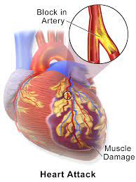

 

 
# SDAIA-T5-BOOTCAMP
## Student Name :  
### Ebtihal Aqeel Najy Almiskeen
 
 
 
 
##           PROJACT NAME
## Heart Disease Binary Classification
 
 
 

 

 

 
 
 
This is my first notebook on Github, ever, any advice or support would be much appreciated :)
# I will be trying different ML models such as LogisticRegression, RandomForestClassifier, as well as KNN to figure out which works better
1 binary target variable: HeartDiseaseorAttack and 21 feature variables that are either binary or ordinal. No missing values. Column names are changed from the originals to be more readable/understandable See source notebook for how I cleaned the BRFSS2015 dataset.
 
Predicting Heart disease (Heart Attack) from medical records using machine learning.
Heart disease (Heart Attack)is considered as one of the serious health issues. which may lead to death .
 
 
# Facts:
    A report released by the Media and Health Awareness Information Center at the Ministry of Health (MOH) pointed out that the Cardiovascular diseases (CVDs), including heart attacks and strokes, are the number-one cause of deaths globally: they are the cause of 17.3 million deaths annually, and this number can be increased. By 2030, almost 23 million people will die from CVDs, mainly from heart disease and stroke, unless effective interventions are taken.
    https://www.moh.gov.sa/en/Ministry/MediaCenter/News/Pages/News-2013-10-30-002.aspx
 
 
# The aim here is to build a model to detect the Heart Attack Disease.
 
# Abstract:-  
 
Heart Attack  is a Cardiovascular disease occurs when one or more of your coronary arteries becomes blocked.
 It caused by many factors for example :
- Buildup of fatty deposits cholesterol.
- Physical activity (Exersise).
- Lifestyle (junk food-stress).
- un-controlled Diabetes, blood pressure .
 
Early prediction of Heart Attack will save your life .
 
### Models  
* K-Nearest Neighbour (KNN).
* Logistic Regression (LR)
* Random Forest (RF).
 
The accuracy is different for every model when compared to other models. The Project work gives the accurate or higher accuracy model  hows that the model is capable of predicting Heart Attack Disease effectively.
we've tried to better the model's accuracy score, let's experiment with different evaluation metrics such as:
1. Confusion_matrix
 
2. Precision
 
3. Recall
 
4. ROC and AUC
 
5. F1
 
6. Classification_report
 
